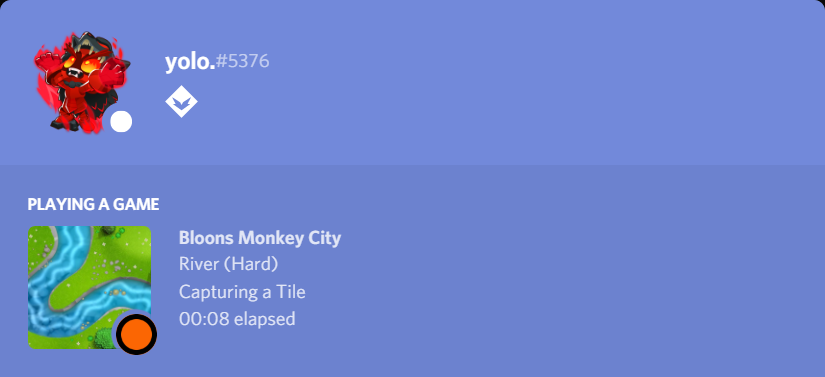
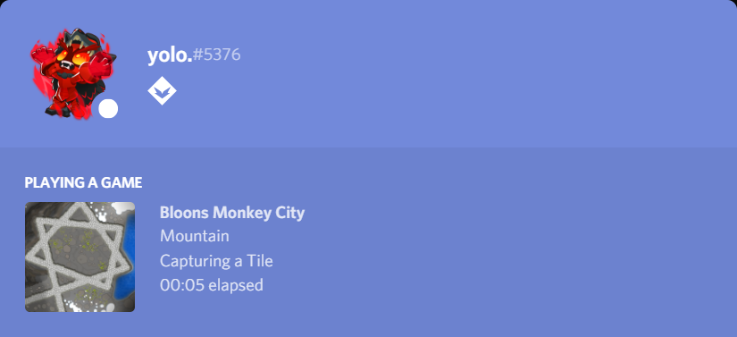

# Bloons Monkey City Pseudo-Rich Presence

**This rich presence will not work by itself.**

Unfortunately, BMC does not have an easy way to find what map you are playing. This "Pseudo-Rich Presence" will allow you to pass arguments for your current state and have that display on your profile.

## Installation

First, clone the repository.

```cmd
git clone https://www.github.com/yolodude25/bmc-rich-presence
```

Then, install the required modules

```cmd
cd bmc-rich-presence
```

```cmd
pip install -r requirements.txt
```

## Usage

Make a copy of [`config.ini.example`](config.ini.example) and remove the `.example`, then [edit it](#config) if you want.

Run `presence.py` with your [arguments](#arguments).

To exit the program just close the python script.

## Arguments

### `-t, --terrain`

Terrain you are playing on.

#### Notes

This argument uses fuzzy search, and you can type approximate map names and if they are close enough, it will recognize them.

#### Available Values

List of all terrains can be found in [`assets.json`](assets.json)

### `-m, --map`

Map you are playing on.

#### Notes

Cannot be used without `--terrain` being set.

If `--terrain` is set but `--map` is not, it will select a random map from the terrain as the image.

This argument uses fuzzy search, and you can type approximate map names and if they are close enough, it will recognize them.

#### Available Values

List of all terrains can be found in [`assets.json`](assets.json)

### `-d, --difficulty`

Difficulty you are playing at.

#### Available Values

`1`, `2`, `3`, `4`, `5`, `6`

`trivial`, `easy`, `medium`, `hard`, `very hard`, `impoppable`

#### Notes

Cannot be used without `--terrain` being set.

## Config

The [config](config.ini.example) allows you to change what is displayed on your rich presence.

### Available Values

- `{terrain_hf}`: Name of terrain (e.g. "Lake")
- `{map_image}`: Image key of map. (e.g. "lake_blade")
- `{map_hf}`: Name of map. (e.g. "Blade")
- `{difficulty_dots}`: Number of dots for the difficulty. (e.g. "2")
- `{difficulty_hf}`: Name of difficulty (e.g. "Easy")
- `{icon}`: Icon of the app.

### `client-id`

The client id of the Discord Application. Don't modify this unless you are using custom assets and know what you are doing.

### Other Headers

The rich presence will show the selected values when the situation in the header is used in the arguments.

## Examples

### River - Doubleback (Hard)

#### Command-Line Arguments

```cmd
python presence.py -t river -m doubleback -d hard
```

#### Rich Presence



### Mountain - Sun

#### Command-Line Arguments

```cmd
python presence.py -t mountain -m sun
```

#### Rich Presence



### Jungle

#### Command-Line Arguments

```cmd
python presence.py -t jungle
```

#### Rich Presence


### Viewing City

#### Command-Line Arguments

```cmd
python presence.py
```

#### Rich Presence


